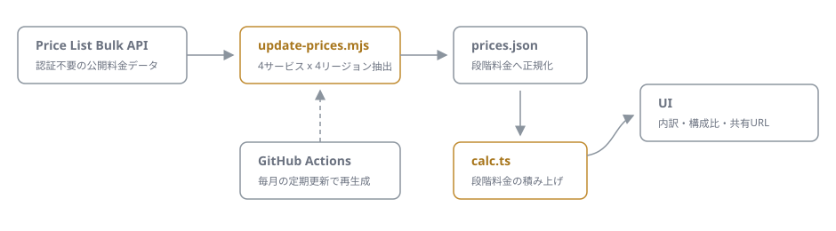

# aws-dentaku

[](https://github.com/miruky/aws-dentaku/actions/workflows/ci.yml)
[](https://www.typescriptlang.org/)
[](https://vitest.dev/)
[](https://opensource.org/licenses/MIT)

**サーバーレス構成(Lambda・API Gateway・DynamoDB・S3)の月額AWS料金を、公開料金データに基づいて見積もるブラウザ電卓です。**

## 概要

リクエスト数や実行時間、ストレージ量といった月間の使用量を入力すると、AWS Price List Bulk APIから取得した実際の料金表で月額コストを計算し、サービス別の内訳と構成比をその場で表示します。段階料金(ボリュームディスカウント)は境界で分割して正しく積み上げ、Lambdaのx86_64 / arm64の単価差やDynamoDBストレージの25GB無料分(料金表に含まれるもの)も反映します。見積もり状態はURLに収まるため、リンクを送るだけで同じ条件を共有できます。

料金データは `scripts/update-prices.mjs` が生成する `src/data/prices.json` に静的に持ち、GitHub Actionsの定期実行(毎月1日)で自動更新されます。計算はすべてブラウザ内で完結し、入力が外部へ送信されることはありません。

試す: https://miruky.github.io/aws-dentaku/

### なぜ作ったのか

AWS Pricing Calculatorは正確ですが、サービスを1つずつ追加して何画面も進む必要があり、「この構成でだいたい月いくらか」を3分で知りたいときには重すぎます。かといってブログ記事の料金表は古くなりがちです。入力欄が1画面に収まっていて、料金データの鮮度を機械的に保てる電卓が欲しかったので作りました。

## 使い方

- リージョン(東京・バージニア北部・オレゴン・アイルランド)とLambdaのアーキテクチャを選びます
- 各サービスの月間使用量を入力すると、即座に月額(USD)とサービス別内訳が更新されます
- 「共有URLをコピー」で、現在の入力をURLとして共有できます

入力例: 月300万リクエストのHTTP API + Lambda(120ms・512MB・arm64)+ DynamoDB読み込み500万・書き込み100万 + S3 50GBで、おおよそ月$11前後になります(東京リージョン、料金改定で変動)。

## アーキテクチャ



`scripts/update-prices.mjs` がPrice List Bulk APIの各サービスオファーから必要なusagetypeのOnDemand料金だけを抜き出し、`[開始量, 終了量, USD単価]` の段階料金リストへ正規化して `src/data/prices.json` に書き出します。アプリ側の `calc.ts` はこの料金表と使用量から純粋関数でコストを計算し、UIは結果を描画するだけです。

## 技術スタック

| カテゴリ   | 技術                                        |
| :--------- | :------------------------------------------ |
| 言語       | TypeScript 5(strict)                        |
| 料金データ | AWS Price List Bulk API(認証不要)           |
| ビルド     | Vite                                        |
| テスト     | Vitest(24テスト)                            |
| リンタ     | ESLint + Prettier                           |
| CI / CD    | GitHub Actions(CI・Pages配信・料金定期更新) |
| 実行時依存 | なし                                        |

## 料金データの更新パイプライン

`update-prices.yml` が毎月1日に `node scripts/update-prices.mjs` を実行し、4リージョン x 4サービスのオファーを取得して `prices.json` を再生成します。生成後にテストを通し、差分があるときだけコミットします。必要なusagetypeが料金表から消えた場合はスクリプトが失敗し、壊れたデータがコミットされることはありません。手元で更新する場合:

```bash
node scripts/update-prices.mjs
```

## プロジェクト構成

- `scripts/transform.mjs` — オファーJSONから段階料金を抽出する純粋関数
- `scripts/update-prices.mjs` — 料金データの取得と `prices.json` の再生成
- `src/data/prices.json` — 正規化済みの料金表(自動生成)
- `src/lib/types.ts` — 料金表と使用量の型
- `src/lib/calc.ts` — 段階料金の積み上げ計算と表示フォーマット
- `src/lib/share.ts` — 見積もり状態のURLエンコード
- `src/app.ts` — 入力フォームと結果表示の配線
- `docs/architecture.svg` — アーキテクチャ図

## はじめ方

### 前提条件

- Node.js 20 以上

### セットアップ

```bash
git clone https://github.com/miruky/aws-dentaku.git
cd aws-dentaku
npm install
npm run dev
```

### テストの実行

```bash
npm test
```

### Lintの実行

```bash
npm run lint
```

### デプロイ

`main` ブランチへのプッシュで GitHub Actions がビルドし、GitHub Pages へ配信します。

## 設計方針

- **料金は実データ駆動** — 単価をコードに書かず、Price List APIから機械的に抽出した料金表だけを使う
- **更新の安全装置** — 抽出できないusagetypeがあれば更新を失敗させ、テストを通った差分だけをコミットする
- **段階料金を正しく扱う** — 境界をまたぐ使用量は段階ごとに分割して計算し、テストで固定する
- **状態はURLに持つ** — 見積もりの共有と復元をサーバーなしで成立させる

## 制約

対象はLambda・API Gateway(HTTP / REST)・DynamoDB(オンデマンド)・S3(標準ストレージ)の4サービス、リージョンは東京・バージニア北部・オレゴン・アイルランドの4つです。データ転送料、無料利用枠(料金表に組み込まれているものを除く)、Provisioned Concurrency、DynamoDBのプロビジョンドモード、S3の他ストレージクラスは扱いません。実際の請求額はAWSの公式見積もりで確認してください。

## ライセンス

[MIT](LICENSE)
